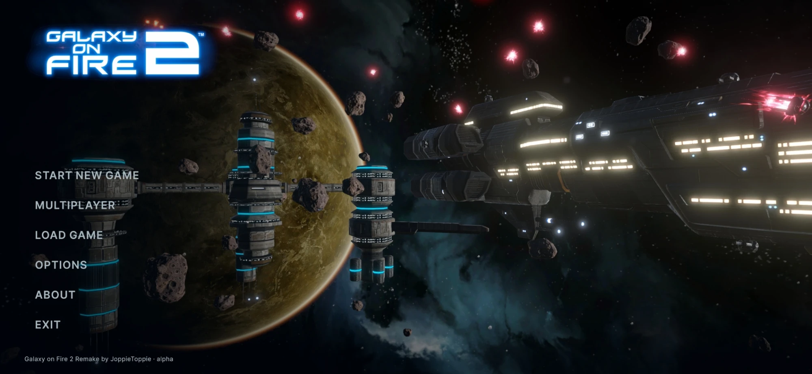

# Galaxy on Fire 2 Remake (Unity)

A remake of the 2010 space game *Galaxy on Fire 2* by FISHLABS in Unity 6, for Windows, Linux and Android. It aims to be a
faithful port of the original gameplay, including flight, combat, trading, mining, stations, the bar and the whole
story. It is built on the original assets and on game logic ported from the decompiled game code.

**Status:** the main campaign, the Valkyrie add-on and the Supernova add-on can be played from start to end. The
Supernova opening and final battle have been rebuilt from the original scripts, but the add-on has not been fully played
through yet. Multiplayer is experimental. A build's version is the date and time of its release (for example
`2026.10.01.1200`), the same on every platform, shown in the main menu.

## Features

- **Story:** the full main campaign with the prologue, the Void and the ending, plus the Valkyrie and Supernova add-ons.
  Dialogue is voiced (English or German), with portraits, radio chatter and cutscenes.
- **Flight:** the original flight model and chase camera. The station orbits are rebuilt exactly like the original,
  with their skies, planets, suns, lens flare and asteroid fields. Travel covers the autopilot, planet jumps,
  fast-forward, the star map, jumpgates, the Khador Drive and the Void's wormhole.
- **Combat:** every weapon, including missiles, beams, EMP, mines, turrets, sentry guns, the Liberator and the other
  special weapons. NPC traffic and AI, capital ships, pirate bases, Specters and the Most Wanted criminals. Combat
  equipment: cloak, emergency system, time extender, repair beams and gamma shields.
- **Economy and stations:** hangars, shops and ship dealers, and the space lounge with bar agents and every
  freelance mission type. Also blueprints, wingmen, medals, the Kaamo Club and save games.
- **Mining:** asteroid mining with the drilling minigame, plus gas clouds, hacking and docking at objects.
- **Multiplayer (experimental):** a shared universe over LAN or VPN. Players see each other in space and in the
  hangars, and can fight each other. Squads share bar missions and their rewards. Everyone shares the NPC traffic, the
  crates, the asteroids and the shop stock. Local and global chat.
- **Remake extras:**
  - Arrival and take-off flights in the hangar, animated dialogue text, and the original-style bloom as an option.
  - Four difficulties (Easy, Normal, Hard, Extreme) that can be changed during a game, and a choice between the PC
    and Android economies for a new game.
  - Other ships' engines like the player's (an option), upscaling (FSR 1, STP), photo mode and screenshots.
  - Discord Rich Presence on Windows: your Discord status shows what you are doing in the game.
  - A Dutch translation, and a choice between German and English voices.
  - Debug tools (Options > Gameplay): jump to any story step, cheats, give items, spawn ships and objects.
- **Controls and screens:** touch, tilt, keyboard and mouse, and controllers (shown with Xbox buttons), all rebindable.
  Gyro steering with a DualSense, DualShock 4 or Switch Pro Controller on Windows. Haptic feedback on controllers and
  Android phones (hits, collisions, explosions, weapons, boost, jumps and mining) with an intensity setting. Landscape
  screens from 4:3 up to 32:9, phones included.

## Getting started

1. Install **Unity 6000.7.0b2** (Unity 6.7) with Unity Hub. Add Android Build Support if you want phone builds.
2. Clone the repository with Git LFS installed. The assets are about 2.1 GB in LFS.
3. Open the project in Unity and open `Assets/Scenes/MainMenu.unity`, then press Play.

The scenes are `MainMenu` (build index 0), `Space` (the flight level) and `Station` (docked). The **GoF2** menu in the
Editor holds the asset build tools. The generated assets are already in the repository.

### Building

Always **switch the active build profile** (File > Build Profiles > Switch Profile) before building another platform.
URP chooses which shader variants to keep from the active platform. An Android build made while Windows was active
renders black, so the editor script `BuildTargetGuard` refuses such builds. `BuildVersionStamp` gives every build its
date and time as its version; for a release, set the Editor process's `GOF2_BUILD_VERSION` environment variable so all
platforms get the same one.

### Multiplayer

In the main menu, open **Multiplayer**. One player hosts a game: the panel lists this device's addresses and the port,
which is 7777 by default. The others join with the host's address, optionally with `address:port`.

## Controls (keyboard)

| Key | Action |
|---|---|
| Arrow keys | Steer |
| W | Boost |
| S | Brake (the engines stop while held) |
| `]` / `/` or the mouse wheel | Throttle |
| Space / left mouse | Primary weapons |
| R / right mouse | Secondary weapon |
| G | Switch secondary weapon |
| A / D | Strafe left / right |
| 1 / 3 | Roll left / right |
| 2 | Level out |
| F / Enter | Action (dock, autopilot, mine, jump) |
| Q | Autopilot menu |
| E | Actions menu (secondary weapons, wingmen, cloak, Khador Drive) |
| Tab | Fast-forward |
| T | Camera / turret view |
| V / K / C / X | Wingmen / Khador Drive / cloak / time extender |
| M or middle mouse | Toggle mouse steering |
| B | Chat (multiplayer) |
| F12 | Screenshot |
| Esc | Pause |

Every flight control can be rebound in Options > Controls (two keyboard / mouse keys and a controller button each).
Controllers and touch are fully supported. The in-game hints show the buttons for whichever input you last used.

## Project layout

```
Assets/Scripts/Runtime/   game code (flight, world, NPCs, UI, multiplayer)
Assets/Scripts/Editor/    import settings, asset and prefab builders, menu items
Assets/Resources/         game data (JSON), assembled prefabs, sky / HUD / combat assets
Assets/UI/                UI Toolkit screens (UXML / USS)
Reference/                decompiled original code, research notes and conversion tools
```

`CLAUDE.md` is the full technical documentation. It covers every system, the original functions it is based on and
the choices the remake made.

## Credits

**Galaxy on Fire 2 Remake** by JoppieToppie.

The remake is built on the **FULL HD version and modifications made by KiritoJPK**, thanks to the Galaxy on Fire 2™ and
4PDA community: <https://github.com/KiritoJPK/Galaxy-on-Fire-2-FULL-HD-Android>

© 2011 Designed and developed by FISHLABS Entertainment GmbH, powered by ABYSS® Game Engine. Galaxy on Fire 2™ and
ABYSS® are registered trademarks of FISHLABS Entertainment GmbH. All rights reserved. This is an unofficial fan project,
not affiliated with or endorsed by FISHLABS or Deep Silver.

Fonts: Inter (SIL Open Font License). Controller gyro: [JoyShockLibrary](https://github.com/JibbSmart/JoyShockLibrary)
by Julian Smart (MIT License). Built with Unity, the Universal Render Pipeline and Netcode for GameObjects.
